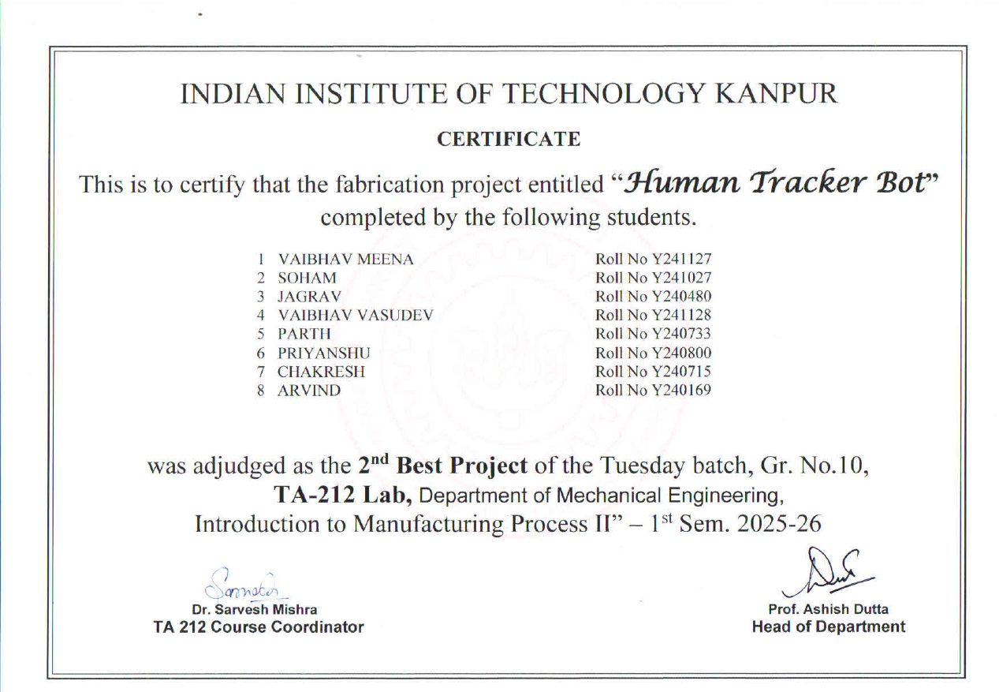
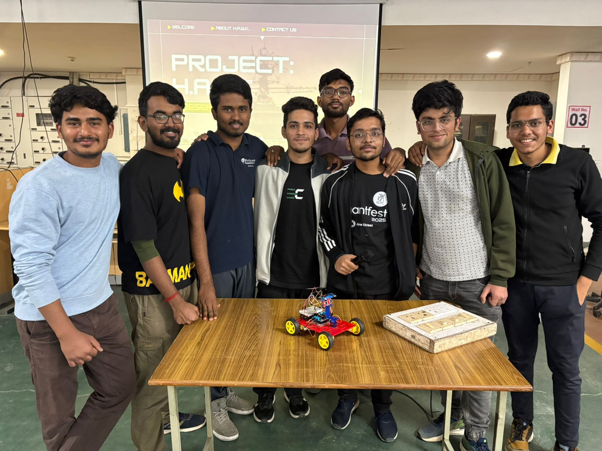

# Autonomous Human-Following Robot

This repository is a digitalization of the course project for **TA212 (Introduction to Manufacturing Process II)** under Professor Sarvesh Mishra, completed during the 2025 Odd semester at the Indian Institute of Technology Kanpur.

An Arduino-based autonomous robot capable of tracking and following a human target. It uses an ultrasonic sensor mounted on a servo motor to gauge distance, and two infrared (IR) sensors to detect directional movement and steer the chassis.

---

## 🏆 Awards & Recognition
This project, officially titled **"Human Tracker Bot,"** was awarded the **2nd Best Project** (Tuesday Batch, Gr. No. 10) in the TA-212 Lab.

---

## 🤝 Team Members
This robot was successfully fabricated and programmed through the collaborative efforts of:
* Vaibhav Meena
* Soham
* Jagrav
* Vaibhav Vasudev
* Parth
* Priyanshu
* Chakresh
* Arvind

---

## 🛠️ Hardware Components
*   **Microcontroller:** Arduino Uno
*   **Motor Driver:** L293D Motor Driver Shield
*   **Motors:** 4x TT Gear Motors with Rubber Wheels
*   **Distance Sensor:** HC-SR04 Ultrasonic Sensor
*   **Directional Sensors:** 2x Infrared (IR) Obstacle Avoidance Sensors
*   **Actuator:** SG90 Micro Servo Motor
*   **Power:** 2x 18650 Li-ion Batteries & Battery Holder
*   **Chassis:** Custom/3D-printed base and acrylic brackets

---

## 🔌 Circuit & Wiring Connections

Attach the L293D Motor Shield directly on top of the Arduino Uno.

**Sensors to Motor Shield:**
*   **Right IR Sensor (OUT):** Analog Pin `A2`
*   **Left IR Sensor (OUT):** Analog Pin `A3`
*   **Ultrasonic Trigger (TRIG):** Analog Pin `A1`
*   **Ultrasonic Echo (ECHO):** Analog Pin `A0`
*   **Servo Motor (Signal):** Digital Pin `10`

*Note: Ensure all VCC pins are connected to 5V and GND pins to Ground. The motor shield requires the jumper cap on the power pins to pull power from the battery pack.*

---

## 🚀 Installation & Setup
1. Assemble the robot chassis, motors, and wire the sensors as per the connections above.
2. Install the necessary Arduino libraries via the Library Manager (`AFMotor.h`, `NewPing.h`, `Servo.h`).
3. Open `src/FollowMeRobot.ino` in the Arduino IDE.
4. Select **Arduino Uno** under `Tools > Board`.
5. Select the correct COM port under `Tools > Port`.
6. Click **Upload**.
